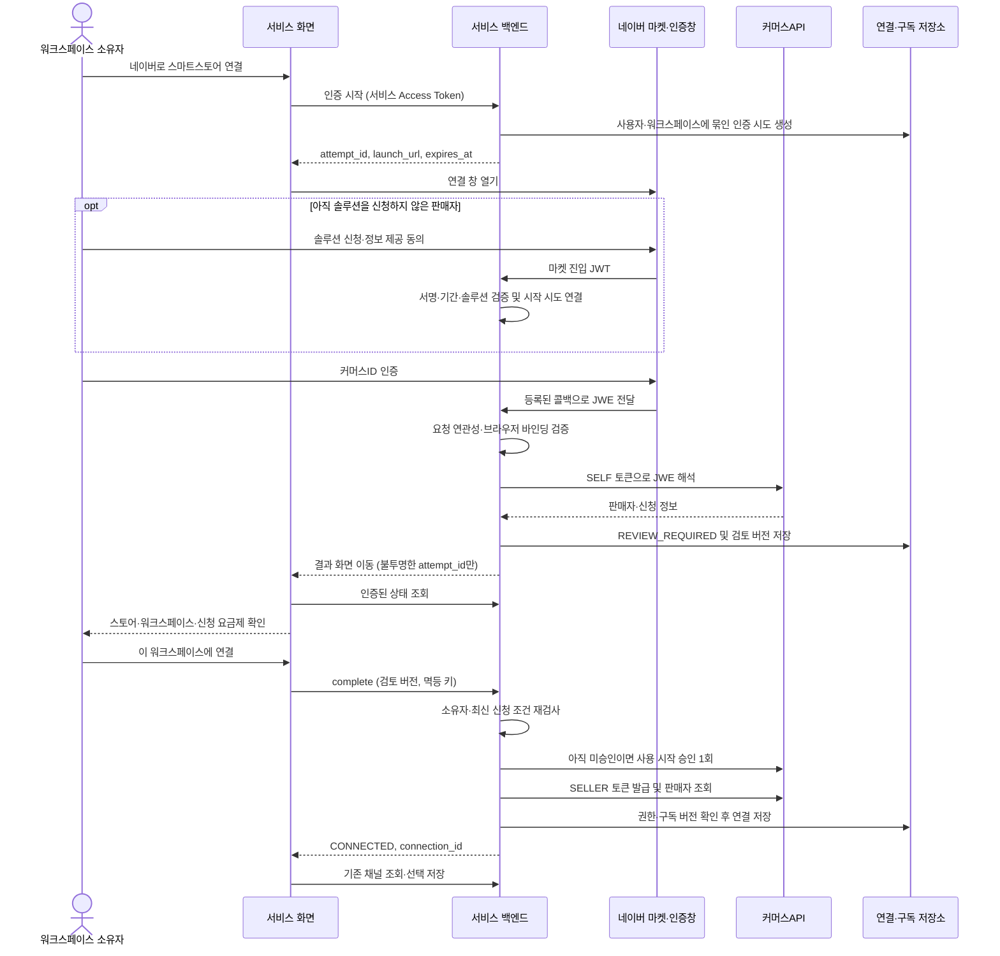

# 네이버 스마트스토어 OAuth 연결 설계

작성일: 2026-09-23 · 상태: 초기 설계 기록 · 대상: `ad-backend` / `ad-frontend`

후속 구현의 실제 API·설정·지원 범위는 [간편 연결 설정](naver-oauth-setup.md)을 기준으로 한다. 솔루션마켓 미등록 상태여서 실제 공급자 연결은 비활성화다. 아래는 구현 전에 작성한 설계 기록이며 운영 연결 완료를 의미하지 않는다.

## 1. 결정과 범위

판매자는 서비스에서 **네이버로 스마트스토어 연결**을 눌러 네이버의 인증·동의를 거친 뒤 스토어를 워크스페이스에 연결한다. 고객에게 앱 ID, 시크릿, 판매자 UID를 입력받지 않는다. 기존 채널 조회·선택·저장은 유지한다.

이번 설계의 기본 흐름은 **커머스솔루션마켓의 심사 후 승인형 + 판매자 커머스ID 인증**이다. 서비스 회원과 워크스페이스의 연결 대상을 확정한 후 구독 사용을 승인한다. 승인 조건을 만족하면 서버가 자동 처리하며 별도 운영자의 수동 심사를 기본으로 두지 않는다. 앞서 검토한 바로 사용형 JWT 연결은 선택 가능한 대안이고 이번 기본 흐름과 구분한다. [공식 구독 연동 방식](https://apicenter.commerce.naver.com/docs/solution-doc/3000/솔루션-구독-연동-프로세스), [심사 후 승인 옵션](https://apicenter.commerce.naver.com/docs/solution-doc/3000/심사-후-승인-옵션-사용-안내)

인증을 두 단계로 구분한다.

| 단계 | 채택 방식 | 결과 |
| --- | --- | --- |
| 판매자의 연결 의사·신원 확인 | 네이버 커머스ID 인증창 → 서버에서 JWE 해석·구독 확인 | 검증된 판매자와 구독 신청 |
| 서버에서 커머스API 호출 | OAuth 2.0 `client_credentials` | 솔루션 관리용 SELF 또는 판매자별 SELLER 토큰 |

커머스API의 공식 토큰 발급은 서버 간 인증이다. 일반 네이버 로그인용 `authorization_code`·`refresh_token` 교환을 스마트스토어 API에 새로 가정하지 않는다. 앱 자격 증명은 서비스 서버가 관리한다. [공식 인증](https://apicenter.commerce.naver.com/docs/auth)

이 문서의 API·테이블·상태·만료 시간은 **초기 서비스 설계안**이며 네이버의 공식 규격과 별개다. 후속 코드 구현과 모의 검증은 진행했지만 실제 로그인 연결, 구독 승인, 결제, 운영 SQL 적용은 수행하지 않았다.

## 2. 연결 흐름



최초 연결에는 솔루션 구독 신청이 선행되어야 한다. 마켓 신청 없이 커머스ID 인증만 완료한 경우 신청 안내로 돌려보낸다. JWE를 해석한 것만으로 구독 승인이 끝난 것으로 판단하지 않는다. 이미 승인된 판매자는 현재 구독과 새 판매자 증명을 확인한 뒤 워크스페이스 연결만 수행하며 구독 승인을 반복하지 않는다. [판매자 커머스ID 인증](https://apicenter.commerce.naver.com/docs/solution-doc/3000/판매자-커머스-아이디-인증)

마켓에서 서비스를 처음 방문한 경우에는 JWT를 서버에서 즉시 검증해 단기 수신 기록을 만들고 서비스 로그인·회원가입으로 이동한다. 이후 소유한 워크스페이스를 명시적으로 선택하고 인증 시도를 시작한다. 마켓 전달값만으로 워크스페이스를 선택하거나 서비스 계정에 자동 로그인시키지 않는다. 로그인 지연으로 증명이 만료되면 네이버 인증을 다시 진행한다.

## 3. 서비스 API 계약

보호 API의 기본 경로는 `/api/workspaces/{workspaceId}/connections/naver`다. 기존 `Api` 응답 래퍼와 snake_case JSON을 사용한다. 인증 시도의 시작·조회·확정·취소는 **현재 워크스페이스 소유자이면서 시작 사용자와 일치하는 사용자**만 가능하다. 다른 사용자의 시도는 404로 처리한다. 기존 연결 목록·채널 API의 멤버 권한은 유지한다.

| 메서드·상대 경로 | 요청 | 응답·동작 |
| --- | --- | --- |
| `GET /capabilities` | 없음 | 연결 모드·운영 준비 여부. 소유자/멤버 조회 가능, 시크릿 제외 |
| `POST /authorizations` | `{ reconnect_connection_id?, marketplace_receipt? }` | 시도 생성, 원래 사용자·워크스페이스 고정 |
| `GET /authorizations/{attemptId}` | 없음 | 서버의 현재 단계·검증된 스토어·검토 버전·결과 조회 |
| `POST /authorizations/{attemptId}/launch-ticket` | 없음 | `WAITING_AUTH` 시도에 한해 인증창을 다시 열 일회용 티켓 발급 |
| `POST /authorizations/{attemptId}/complete` | `{ review_revision }`, `Idempotency-Key` 헤더 | 검토한 대상 확정, 필요 시 사용 승인, 연결 저장 |
| `POST /authorizations/{attemptId}/cancel` | 없음 | `WAITING_AUTH / VALIDATING / REVIEW_REQUIRED`만 원자적으로 취소. 그 외 진행 상태는 409 |

`reconnect_connection_id`는 기존 연결의 내부 ID다. 새 연결에는 생략한다. `marketplace_receipt`는 같은 브라우저에 바인딩된 서버 발급 단기 핸들이며 JWT/JWE 원문이나 클라이언트가 작성한 판매자 정보가 아니다.

결과 화면의 새 탭·새로고침·로그인 복귀를 위해 `GET /api/integrations/naver/authorizations/{attemptId}`도 제공한다. 서비스 인증과 동일한 시작 사용자·현재 소유자 검사를 수행하고 서버에 저장된 `workspace_id`를 포함해 같은 상태 응답을 반환한다. 워크스페이스 경로가 없는 공개 조회 API로 만들지 않는다. 결과 화면은 이 API로 대상을 복구한 뒤 워크스페이스별 API를 사용한다.

launch 티켓 재발급은 원래 브라우저 바인딩을 유지하고 provider 요청 세대를 증가시킨다. 이전 티켓·nonce와 늦은 콜백은 무효다. 증명 검증이 진행 중이거나 승인 작업을 시작한 시도에는 새 창을 발급하지 않는다. 취소와 콜백 완료·확정은 시도 버전으로 경쟁을 해결하여 취소된 시도를 다시 진행 상태로 바꾸지 않는다.

인증 시작 성공 시 `Api.body` 예시:

```json
{
  "attempt_id": "<추측 불가능한 시도 ID>",
  "status": "WAITING_AUTH",
  "launch_url": "https://app.example.com/open-api/integrations/naver/launch?ticket=<일회용 티켓>",
  "expires_at": "2026-09-23T05:10:00Z"
}
```

`launch_url`은 서비스 서버가 생성하는 동일 origin 주소다. 네이버의 인가 URL을 추정해서 프런트에서 조합하지 않는다. `app.example.com`은 설계 예시이며 등록된 실제 도메인으로 설정한다.

검토 가능한 상태의 `Api.body` 예시:

```json
{
  "attempt_id": "<시도 ID>",
  "workspace_id": 1,
  "status": "REVIEW_REQUIRED",
  "review_revision": 2,
  "seller": { "name": "우리 스토어", "store_url": "https://smartstore.naver.com/example" },
  "subscription": { "requires_approval": true, "plan_name": "<검증된 요금제 이름>" },
  "connection_id": null,
  "next_action": "CONFIRM_CONNECTION"
}
```

요금제·금액·결제 영향은 서버가 검증한 정보만 표시한다. 조회할 수 없는 금액을 무료로 간주하지 않는다. 신청 요금제나 대상이 바뀌면 `review_revision`을 올리고 새 확인을 요구한다. 클라이언트는 `account_uid`, `solution_id`, 구독 상태를 확정 요청으로 지정할 수 없다.

`complete`는 즉시 완료 시 200, 진행/결과 확인 중이면 202와 상태를 반환한다. 성공 응답에는 `connection_id`를 넣고 기존 연결 목록을 다시 조회한다. 동일 시도·멱등 키의 요청은 저장된 결과를 반환하며 외부 승인 작업을 재발행하지 않는다. 키만 바꾸어도 같은 시도의 승인 횟수가 늘어나지 않는다. 다른 내용의 재사용 키는 409다. 결과 GET은 원격 승인 작업을 시작하지 않는다.

추가 공개 수신 경로:

| 메서드·전체 경로 | 검증·용도 |
| --- | --- |
| `GET /open-api/integrations/naver/launch` | 일회용 티켓과 시작 때 설정된 브라우저 바인딩을 대조한 뒤 등록된 인증 절차 시작 |
| `GET /open-api/integrations/naver/marketplace` | 마켓 JWT 수신·검증 후 단기 핸들로 교체 |
| `GET /open-api/integrations/naver/callback` | JWE 수신, 시작 시도와 연관성 확인, 서버 해석 후 검토 상태로 전환 |
| `POST /open-api/integrations/naver/events` | 등록한 전용 인증 헤더 검증 후 이벤트 배열 영속 수신 |

네이버가 보내는 쿼리 이름·팝업 호출 인자는 솔루션 등록 규격을 확정한 뒤 수신 어댑터에 매핑한다. 위 경로명은 모두 우리 서비스가 등록할 경로이며 네이버의 경로가 아니다. 콜백에는 서비스 Bearer가 없으므로 API 소유자 인증을 흉내 내지 않고 별도의 검증을 수행한다.

## 4. 네이버 어댑터와 확정해야 할 경계

서버의 `NaverSolutionClient`는 다음 원격 기능을 제공한다. 기본 주소는 `https://api.commerce.naver.com/external`이다.

| 원격 API | 용도 | 근거 |
| --- | --- | --- |
| `POST /v1/oauth2/token` | 솔루션 SELF / 판매자 SELLER 토큰 | [토큰 발급](https://apicenter.commerce.naver.com/docs/commerce-api/current/exchange-sellers-auth) |
| `GET /v1/commerce-solutions/seller-info-by-token` | JWE를 서버에서 해석 | [JWE 해석](https://apicenter.commerce.naver.com/docs/commerce-api/current/get-seller-info-by-token-merchant) |
| `PUT /v1/commerce-solutions/subscriptions/approve` | 사용 시작 승인 | [승인 API](https://apicenter.commerce.naver.com/docs/commerce-api/current/approve-subscription-merchant) |
| `GET /v1/commerce-solutions/subscriptions/:accountUid` | 구독 상태 재확인·불확실한 승인 결과 복구 | [상태 조회](https://apicenter.commerce.naver.com/docs/commerce-api/current/get-subscription-merchant) |

SELF는 솔루션 관리에만, SELLER는 검증한 판매자의 채널·계정 조회에만 사용한다. `SELF`의 의미를 기존 고객 내스토어 앱 연결과 혼동하지 않도록 자격 증명 공급원을 별도로 구분한다.

구현 시작 전에 등록된 테스트 솔루션으로 다음 규격을 채워야 한다. **확인 전에는 인증 버튼을 운영에 노출하지 않는다.** 나머지 서비스 구조·모의 구현은 이 문서대로 진행할 수 있다.

- 공식 커머스ID 팝업 실행 URL/SDK, 필수 인자, 취소·실패 콜백 형식.
- 인가 요청과 콜백을 연결할 `state`/nonce 왕복 또는 공식적으로 허용되는 동등한 요청 바인딩 수단. 지원 여부를 추정하지 않는다.
- 마켓 진입 JWT·JWE의 실제 전달 필드명, JWE 해석·승인의 요청/응답 스키마와 이미 구독 중인 사용자의 인증 경로.
- 솔루션 ID, 앱 ID/시크릿, JWT 공개키, 등록 URL, 허용 IP, 필요한 API 그룹.
- 신청 요금제 정보와 승인에 따른 결제 조건. 등록한 이벤트 인증 헤더·키.

`NaverAuthorizationProvider` 인터페이스가 공식 팝업 실행과 콜백 정규화를 감싼다. 증명 검증, 워크스페이스 권한, 구독 승인은 서비스 서버의 책임이다. 일반 네이버 로그인 엔드포인트나 가상의 authorize URL로 대체하지 않는다.

공식 가이드는 솔루션 등록과 심사, 커머스ID 고급 옵션 설정을 요구한다. 입점 자격·옵션은 실제 개발사 계정에서 확인해야 한다. [등록 설정](https://apicenter.commerce.naver.com/docs/solution-doc/4000/솔루션-등록-개발사-정보-입력), [입점 절차](https://apicenter.commerce.naver.com/docs/solution-doc/1000/마켓-입점-프로세스)

## 5. 인증 시도와 브라우저 바인딩

연결 대상 권한은 **서비스 로그인 + 소유자 권한 + 검증된 네이버 판매자 증명 + 시작한 브라우저·시도**의 조합으로 결정한다. JWE에 담긴 판매자 UID만으로 워크스페이스 연결 권한이 생기지 않는다.

- 보호된 시작 POST에서 32바이트 난수로 nonce, 브라우저 바인딩 비밀값, 별도 launch 티켓을 만든다. 서버에는 바인딩 해시를 저장하고 이 응답에서 시도별 HttpOnly·Secure 쿠키를 설정한다. launch 티켓은 60초·일회용이며 사용자 조작 유효 시간은 10분으로 제안한다. 네이버 토큰의 공식 유효 시간과 독립적이다.
- 공개 launch GET은 이미 설정된 바인딩 쿠키와 티켓을 대조해야 하며 새 브라우저로 바인딩을 설정하거나 옮기지 않는다. 공격자가 자기 시도의 launch URL을 다른 사람에게 보내 그 사람의 스토어를 가져오는 흐름을 차단한다. 티켓 재발급·콜백·complete도 최초 브라우저 바인딩을 확인한다.
- 쿠키는 시도별 이름을 사용해 다른 탭의 값을 덮어쓰지 않고 API와 콜백 양쪽에서 검증할 수 있는 동일 host·Path=/ 범위를 사용한다. GET 리다이렉트에는 SameSite=Lax를 사용하되 실제 공급자 전송 방식으로 검증한다. 보호된 시작·변경 API는 Bearer와 허용된 동일 origin을 검사하고 외부 origin에서 자격 증명을 포함한 호출을 허용하지 않는다.
- 콜백은 provider가 보장하는 요청 연관성 값과 서버 시도, 해당 브라우저 바인딩을 모두 대조한다. 고정 콜백 URL만 있거나 쿠키만 있다는 이유로 요청이 연결되었다고 간주하지 않는다. 공식 요청 바인딩을 구성할 수 없다면 이 팝업 연결 경로는 활성화하지 않는다.
- 마켓에서 먼저 들어온 유효 JWT는 미귀속 증명으로만 보관한다. 로그인·워크스페이스 선택 후 새 시도에 귀속하며 원래 서비스 시작 시도가 있으면 동일 브라우저·원래 대상에만 복귀한다. URL의 workspace 값, 마지막으로 열린 탭, 저장된 전역 선택값을 연결 권한으로 사용하지 않는다.
- JWT는 솔루션 공개키, 허용된 서명 알고리즘, 발급·만료 시각, 발급자/유형 및 솔루션 ID를 검증한다. 검증 실패 시 공식 오류 경로로 이동한다. JWE는 서버에서 공식 해석 API를 호출한다. [JWT 검증 가이드](https://apicenter.commerce.naver.com/docs/solution-doc/3000/기본-연동-요소-가이드)
- 사용자 확인 직전에 JWE의 최신 신청 정보와 승인 가능 여부를 다시 확인한다. `accountAuthentication`·`approveSubscriptionYn` 등의 의미와 자료형은 실제 명세에 맞춰 엄격히 매핑한다. 인증 완료와 승인 가능을 같은 boolean으로 합치지 않는다. [심사 체크리스트](https://apicenter.commerce.naver.com/docs/solution-doc/5000/심사-전-체크리스트)
- 원문 JWT/JWE는 전용 수신기에서만 취급하고, 접근 로그·트레이스·오류 응답의 쿼리와 본문에서 제거한다. 콜백은 제3자 스크립트를 로드하지 않으며 `Cache-Control: no-store`, `Referrer-Policy: no-referrer`를 적용하고 즉시 원문 없는 결과 URL로 이동한다.
- 프런트에는 시도 ID와 검증된 표시 정보만 전달한다. 서비스 Access Token, 커머스 토큰, 시크릿, provider 증명을 URL·localStorage에 추가하지 않는다. 기존 서비스 토큰 저장 방식을 전면 변경하는 것은 이번 범위에 포함하지 않는다.
- 로그인 만료 시 원래 시도 URL로 복귀하되 시작 사용자 일치를 검사한다. 로그인한 계정이 바뀌면 자동으로 시도를 넘기지 않는다. 허용된 내부 복귀 경로만 사용한다.

## 6. 상태·외부 승인·실패 복구

| 서비스 시도 상태 | 의미·허용 행동 |
| --- | --- |
| `WAITING_AUTH` | 마켓 신청/네이버 인증 대기. 만료 전 다시 창 열기 또는 취소 |
| `VALIDATING` | 콜백 증명 검증·최신 신청 정보 조회 중 |
| `REVIEW_REQUIRED` | 스토어·워크스페이스·필요한 요금제 정보를 확인하고 확정 가능 |
| `APPROVING` | 사용자 확정 후 외부 승인 전송 예정/진행 중. 추가 전송·취소 불가 |
| `RECONCILING` | 승인 성공 여부 미확정. 읽기 전용 상태 조회로 복구 |
| `VERIFYING_CONNECTION` | 구독은 승인됐고 SELLER 토큰·판매자 검증·DB 저장 진행 중 |
| `CONNECTED` | 구독·토큰·판매자·워크스페이스 저장 완료. 채널 선택으로 이동 |
| `FAILED` / `CANCELLED` / `EXPIRED` | 명확한 실패 / 외부 승인 전 취소 / 사용자 인증 기한 만료 |

네이버 구독 상태는 위 UI 상태와 다른 컬럼으로 저장한다. 새 상태를 알 수 없으면 임의로 활성 상태로 해석하지 않는다.

`complete`는 짧은 DB 트랜잭션으로 시도와 구독별 승인 작업을 claim하고 사용자 확인 정보를 고정한다. 원격 호출 중 DB 락을 계속 잡지 않는다. `(application_ref, account_uid, provider_subscription_id)` 단위 승인 작업은 모든 워크스페이스에 걸쳐 하나만 진행한다. 승인 직전과 연결 저장 직전에 소유자·판매자·구독 버전을 다시 확인한다.

승인 작업의 유일 키에 쓰는 모든 필드는 검증된 NOT NULL 값이어야 한다. 특히 provider subscription ID를 아직 확인하지 못한 경우 작업을 생성하지 않고 신청 정보를 먼저 조회한다. 빈 문자열·가짜 ID로 채우지 않는다. 결과 복구도 현재 판매자가 활성인지뿐 아니라 동일한 구독 수명·판매자·계정 매핑에 대한 승인 결과인지 확인한다.

외부 승인 요청을 보내기 전에 `DISPATCHING`을 영속 저장한다. 이 지점 이후 워커가 중단되면 요청이 도착하지 않았다고 추정하지 않고 `RECONCILING`으로 복구한다. 승인 성공 후 저장 실패도 재승인 대신 토큰/저장 단계만 재개한다. 공급자 멱등 지원은 확인 전까지 가정하지 않는다.

| 상황 | 처리 |
| --- | --- |
| 네이버 창 닫음 | 우선 상태 조회. 승인 전이면 소유자가 명시적으로 취소, 진행 중이면 결과 확인 유지 |
| 권한 부족·미신청·만료 증명 | 원인별 안내와 재인증/신청 진입. 기존 정상 연결 유지 |
| 검토 후 요금제·판매자 변경 | 409, 새 검토 화면. 이전 확인으로 승인하지 않음 |
| 승인 타임아웃·5xx·응답 해석 실패 | `RECONCILING`; 상태 조회·인증된 이벤트로 확인, 자동 승인 재전송 없음 |
| 조회로 현재 구독을 확인할 수 없음 | 확인 대기 유지. 운영 확인 대상으로 남기고 연결 성공 표시 금지 |
| 승인 완료 후 서비스 권한 상실 | 구독 작업 결과만 보존하고 해당 워크스페이스에 연결하지 않음. 자동 해지/환불 없음 |
| 동시에 다른 탭에서 확정 | 서버 claim·버전·멱등 처리로 동일 결과. 추가 승인은 실행하지 않음 |
| 재연결에서 다른 판매자 인증 | `SELLER_MISMATCH`; 기존 연결 보존. 다른 스토어는 새 연결로 다시 시작 |

`complete`의 401은 프런트 공통 인터셉터의 자동 갱신·재전송을 사용하지 않는다. 로그인 복구 후 GET으로 상태를 먼저 확인한다. 이미 claim된 시도는 새 멱등 키로 재요청해도 외부 승인 작업을 다시 만들지 않는다. 조회 요청의 일반 토큰 갱신은 유지한다.

비즈월렛 유료 요금제는 사용 승인 시 결제가 발생할 수 있다. 따라서 신청된 요금제와 결제 영향을 최종 확인에 포함한다. 인증을 성공했다는 이유만으로 콜백에서 승인을 호출하지 않는다. [승인과 결제의 관계](https://apicenter.commerce.naver.com/docs/solution-doc/3000/판매자-커머스-아이디-인증)

사용자 인증 기한이 지나도 이미 전송된 승인 작업을 삭제하거나 실패로 확정하지 않는다. 짧은 인증 시도와 지속되는 승인 작업을 분리한다. 복구 작업의 판매자·구독·소유자 재검증 후 필요하면 새 서비스 확인을 요구한다.

## 7. 데이터·자격 증명 구조

현재 `naver_connections`는 client ID/secret, 토큰, 만료 시각이 NOT NULL이므로 인증 대기 상태를 기존 연결 행에 억지로 저장할 수 없다. 기존 스키마와 [현재 연결 명세](naver-connections.md)를 기준으로 다음 확장을 적용한다.

| 저장소 | 제안 필드·제약 |
| --- | --- |
| `naver_authorization_attempts` 신규 | 불투명 ID, workspace/user ID, reconnect 대상, 상태, proof 참조, nonce/browser 바인딩 해시, 만료, review revision, connection ID, operation ID, 낙관적 버전 |
| `naver_solution_subscriptions` 신규 | 내부 ID, application ref, solution ID, 검증한 account UID, 현재 provider subscription ID, account mapping ID, 구독 상태·버전·검증 시각. UNIQUE(application ref, account UID) |
| `naver_subscription_operations` 신규 | 구독 수명별 승인 작업, 요청 확인 정보·작업 단계·결과·조회 복구 시각. UNIQUE(application ref, account UID, provider subscription ID, operation type); 유일 키의 모든 컬럼 NOT NULL |
| `naver_solution_event_inbox` 신규 | solution ID, event ID, change type, 최소 필요 이벤트 정보, 처리 상태. UNIQUE(solution ID, event ID, change type) |
| `naver_connections` 확장 | credential source, application ref, subscription FK, bound provider subscription ID/구독 세대, credential version 추가. 수동 자격 증명 nullable 전환 |
| 임시 proof 저장소 | JWT 검증 결과·암호화된 최신 JWE, 시도/브라우저 바인딩, 수신 시각·만료. 일반 연결 행과 분리 |

`credential_source`는 기존 행에 `MANUAL`, 새 연결에 `SOLUTION`을 사용한다.

- `MANUAL`: 기존 client ID/암호화 secret 필수. 기존 SELF/SELLER 동작 유지.
- `SOLUTION`: application ref·subscription FK 필수, `token_type=SELLER`, `account_id`는 검증된 account UID. 워크스페이스 행에 공용 client secret을 복사하지 않음.
- 실제 API 호출 가능한 연결은 토큰·만료 시각이 모두 있어야 한다. 해지 시 토큰을 제거할 수 있도록 해당 두 컬럼을 nullable로 확장하되, 사용 가능 여부는 구독 상태·requires_reauth·토큰 유무를 함께 검증한다. 기존 활성 MANUAL 행에는 NOT NULL과 동등한 서비스 검증을 유지한다.
- 공통 연결의 `(workspace_id, provider_type, external_account_id)` 유일성 및 기존 내부 연결/자산 ID를 유지한다. 재연결은 같은 UID일 때만 갱신한다.
- 한 판매자를 여러 워크스페이스에 연결하는 기존 정책을 유지한다. 각 워크스페이스 소유자의 독립된 인증·확정이 필요하다. 공유 구독이 있다는 이유로 다른 워크스페이스에 연결 권한을 부여하지 않는다.
- `account_mapping_id`는 솔루션의 해당 구독 수명을 식별하는 서버 생성 불투명 값이다. 한 워크스페이스 ID로 사용하지 않는다. 재구독은 새 provider subscription ID·새 매핑·새 버전을 사용하고 이전 작업 기록을 보존한다.
- SOLUTION 연결에는 소유자가 승인한 구독 수명 ID/세대를 고정 저장한다. 현재 구독 집계 행을 FK로 참조하는 것만으로 권한을 판단하지 않는다. 재구독으로 집계 행이 활성화되어도 이전 세대 연결은 차단·토큰 없음 상태를 유지하며 워크스페이스별 새 인증·확정 후에만 새 세대로 바꾼다.

`NaverCredentialResolver`가 MANUAL의 기존 암호화 정보 또는 SOLUTION의 서버 설정을 공급한다. SOLUTION에서는 연결에 고정한 구독 수명/세대와 현재 승인된 구독이 일치해야 한다. SELF 토큰 캐시 키는 application ref + credential version, SELLER 키는 여기에 account UID + 구독 버전을 포함한다. 기존 `sameAccountCredentials()` 비교에도 공급원·앱·구독·버전을 추가한다. 해지 직전에 시작한 조회·토큰 갱신 응답이 새 상태를 덮어쓰지 못하게 한다.

설정 제안: `naver.solution.enabled`, `application-ref`, `solution-id`, `client-id`, `client-secret-ref`, `jwt-public-key-ref`, `marketplace-url`, `callback-url`, `webhook-header-name`, `webhook-secret-ref`. 시크릿·키는 운영 비밀 저장소에서 공급하며 프런트 환경 변수로 내보내지 않는다. 공개키 갱신과 앱 시크릿 교체를 위해 버전을 둔다.

원문 proof는 연결 완료·취소·만료 후 제거한다. 진행 중 승인 복구에 필요한 JWE는 공급자 유효 기간 안에서만 암호화해 제한 보관하고 이후에는 구독 식별자·작업 결과로 복구한다. 인증 시도·작업의 비밀정보 없는 감사 기록 보존 기간은 서비스 보존 정책에 맞춰 설정한다.

## 8. 구독 이벤트와 접근 철회

네이버 이벤트 훅은 등록한 이름/값의 HTTP 인증 헤더와 배열 본문을 사용한다. 인증 후 inbox에 영속 저장하고 200을 반환한다. 저장 실패는 성공 응답으로 숨기지 않는다. 워커가 이벤트를 적용한다. [공식 이벤트 훅](https://apicenter.commerce.naver.com/docs/solution-doc/3000/이벤트-훅-연동-요소-가이드)

- 공식 안내에는 다른 이벤트가 같은 event ID로 전달되는 사례가 있으므로 event ID 하나만으로 중복을 제거하지 않는다. `(solution_id, event_id, change_type)` 수신 중복 제거와 상태 전환의 멱등성을 함께 적용한다.
- 외부 전달 순서와 별개로 내부 병렬 워커·복구 작업이 순서를 바꿀 수 있다. 구독별 직렬 처리·버전 확인으로 오래된 이벤트가 새 구독을 덮어쓰지 못하게 한다.
- 이벤트에 subscription ID가 항상 있다고 가정하지 않는다. 검증한 solution/account와 account mapping 정보를 확인하고, 구독 수명이 불명확하면 공식 상태 조회로 현재 구독을 재확인한다. 확인 중에는 해당 SOLUTION 연결의 사용을 일시 보류한다.
- `END_SUBSCRIPTION`·강제 해지 확정 시 같은 솔루션 구독을 사용하는 모든 워크스페이스 연결을 차단하고 토큰을 제거한다. 진행 중 인증 시도와 캐시도 무효화한다. MANUAL 연결은 자동 변경하지 않는다.
- 해지 예약은 실제 해지와 구분한다. 결제/요금제 관련 상태를 임의로 연결 성공·실패로 합치지 않고 공식 현재 상태를 반영한다. 알 수 없는 이벤트는 기록하고 재확인한다.
- 앱의 로컬 연결 해제와 네이버 구독 해지·환불을 별도 동작으로 정의한다. 로컬 해제 버튼으로 다른 워크스페이스가 쓰는 구독을 자동 해지하지 않는다. 최초 범위에서는 구독 해지는 네이버 관리 화면으로 안내한다.
- 접근 차단은 즉시 적용한다. 해지에 따른 판매자·구매자 정보의 삭제/보존 범위는 마켓 심사 요구에 맞는 정리 작업으로 처리하며 자산 행을 이유 없이 영구 보관한다고 보장하지 않는다. 현재 상품·주문 수집 기능은 범위 밖이다. [심사 기준](https://apicenter.commerce.naver.com/docs/solution-doc/5000/심사-전-체크리스트)

## 9. 화면과 기존 코드 변경 지점

| 위치 | 변경 내용 |
| --- | --- |
| `ad-frontend/src/pages/workspace/NaverConnectionsPage.tsx` | 기본 CTA를 네이버 인증 연결로 변경. 기존 연결 목록·채널 선택 UI 유지 |
| `src/hooks/useNaverConnections.ts`, `src/api/naverConnections.ts` | 기존 채널 기능 유지. 연결 시작/상태/확정은 새 훅·API 모듈로 분리 |
| `src/hooks/useNaverAuthorization.ts` 신규 | 시도별 진행·팝업·상태 조회·검토/완료·오류 복구 |
| `src/pages/workspace/NaverOAuthCallbackPage.tsx` 신규 | `/settings/integrations/naver/callback?attempt_id=…`에서 전역 보호 상태 GET으로 workspace ID 복구. URL의 success 값으로 완료 판단 금지 |
| `src/App.tsx`, 로그인/가입 복귀 | 결과 화면 경로·문서 제목·메뉴 선택. 로그인과 회원가입 사이에도 내부 복귀 경로 유지 |
| 백엔드 `NaverAuthorizationApiController/Business/Service` 신규 | 인증 시도·소유자 확정·승인 작업·연결 저장 |
| 백엔드 `NaverAuthorizationCallbackController`, `NaverSolutionEventController` 신규 | 공개 수신 전용 검증·결과 이동·이벤트 inbox |
| `NaverSolutionClient`, `NaverCredentialResolver` 신규 | 솔루션 원격 API와 자격 증명 공급원 분리 |
| 기존 `NaverConnectionBusiness/Service`, `PlatformConnectionService` | 공급원별 재발급, 구독 상태·버전 확인, 동일 UID 전환 및 안전한 nullable 처리 |

최종 확인 화면은 스토어 이름·URL, 워크스페이스 이름, 연결/재연결 여부, 신청된 요금제와 승인 영향을 표시한다. 버튼은 **이 워크스페이스에 연결**로 한다. 운영 준비가 안 되면 기능 준비 상태를 표시하고 동작하지 않는 네이버 버튼을 노출하지 않는다.

팝업은 사용자 클릭에서 열고 준비된 URL로 이동한다. 차단 시 다시 열기 동작을 제공한다. iframe은 사용하지 않는다. 팝업 실행 화면과 JWE 콜백은 **동일한 HTTPS origin**으로 구성해 문서의 도메인 조건을 충족한다. 개발 시에도 등록 가능한 HTTPS 테스트 도메인과 같은 origin 프록시를 사용한다. [인증 화면 심사 기준](https://apicenter.commerce.naver.com/docs/solution-doc/5000/심사-전-체크리스트)

`postMessage`는 허용 origin·팝업 Window 참조·시도 ID를 확인한 뒤 상태 재조회 신호로만 사용한다. 팝업이 끊기거나 새로고침되어도 원래 화면의 인증된 GET으로 복구한다. UI 조회는 2초 시작·점진적 간격 증가로 최대 10초, 백그라운드 탭에서는 일시 중지한다. 시도 만료 후에는 사용자 동작을 중단하되 이미 진행한 승인 결과 확인은 계속 가능하게 한다.

기존 수동 연결은 호환 모드로 유지한다. 신규 기본 UI에서 숨기되 기존 수동 연결의 재연결 경로는 제공한다. 소유자가 해당 연결에서 솔루션 방식 전환을 시작하고 같은 UID를 인증한 경우에만 기존 ID·자산을 유지하며 전환한다. 전환 실패 시 기존 정상 자격 증명을 지우지 않는다. 공통 연결 응답에는 네이버 전용 선택 필드로 `connection_mode`, `connection_status`를 추가하고 기존 필드 의미를 유지한다.

## 10. 구현 순서와 완료 기준

1. 테스트 솔루션 등록 및 4절의 provider 어댑터 계약 확정. 공식 팝업과 요청 바인딩을 실제 테스트 도메인에서 확인한다.
2. 스키마 확장·MANUAL 기본값 역채움·자격 증명 resolver·기존 API 회귀 검증. 부모 FK의 signed/unsigned 형식과 기존 `SET NULL` 동작을 유지한다.
3. 시도·콜백·증명 검증·검토 상태 구현. 이 단계까지 실제 사용 승인을 호출하지 않고 모의 응답으로 검증한다.
4. 멱등 승인 작업·상태 조회 복구·SELLER 토큰 발급·워크스페이스 저장 연결.
5. 이벤트 inbox·철회·버전 경합 및 삭제 정책 처리. 프런트 연결/결과/채널 선택 흐름 연결.
6. 개발사 테스트 스토어로 최초 신청·기존 구독·해지·재신청까지 검증한 뒤 준비된 솔루션만 기능 플래그로 활성화한다.

필수 검증 사례:

- 소유자만 시작·확정 가능; 시작 후 소유권 상실, 다른 사용자·워크스페이스의 시도 접근 거부.
- 위조/만료 JWT, 다른 솔루션, 잘못된 JWE, 요청 바인딩 불일치, proof 재사용, 열린 리다이렉트 차단.
- 다른 브라우저에 전달한 launch URL로 인증할 수 없음; 시작·재발급·완료의 브라우저 바인딩 일치; 오래된 launch 콜백 무효화.
- 두 탭·두 워크스페이스의 콜백 순서가 뒤집혀도 대상 혼동 없음; 서버 재시작 후 시도/승인 작업 복구.
- 구독 미신청·승인 불가·판매자 변경·요금제 변경·로그인 만료와 로그인 계정 변경.
- 승인 연속 클릭·다른 멱등 키·동일 판매자의 동시 연결에도 외부 승인 1회; 전송 직전/직후 중단 및 DB 저장 실패 복구.
- 401 자동 재전송 없음; 5xx·타임아웃은 읽기 확인; 외부 승인 성공과 워크스페이스 저장 성공을 구분.
- 동일 UID의 MANUAL 전환은 연결/자산 ID 유지; 다른 UID는 기존 연결 보존; 기존 SELF/SELLER 수동 기능 유지.
- 해지 이벤트 중복, 동일 event ID의 서로 다른 change type, 구독 재신청 후 오래된 이벤트, 토큰 갱신과 해지 경합.
- 재구독 시 이전 워크스페이스 연결 자동 복원 없음; 각 소유자가 새 구독 수명으로 재확정한 연결만 사용 가능.
- 원문 토큰/시크릿/증명이 프런트 URL·서비스 응답·접근 로그·오류 트레이스에 남지 않음.
- 팝업 차단·닫기·모바일·새로고침·로그인/가입 복귀·승인 결과 불명에서 잘못된 연결 성공이나 재승인 없음.

이 문서 작성 시에는 현재 소스와 공식 문서의 계약을 대조했다. 구현 완료나 위 테스트의 통과를 의미하지 않는다.
